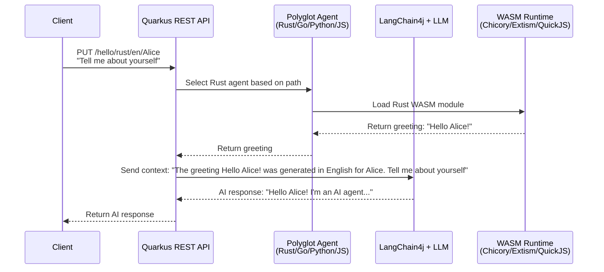

# The JVM as a Viable Polyglot Runtime: A Server-Side Take on Browser-Native AI Agents

*Following up on [Baris Guler's excellent exploration](https://blog.mozilla.ai/3w-for-in-browser-ai-webllm-wasm-webworkers/) of browser-native AI agents using WebLLM + WASM + WebWorkers, we're excited to present a complementary approach that leverages the Java Virtual Machine's unique polyglot capabilities and enterprise-grade infrastructure.*

## Introduction

While Baris's 3W stack brilliantly demonstrates how to bring AI agents directly into browsers, we've been exploring a different angle: what if we leveraged the JVM's polyglot capabilities to create a server-side equivalent that's equally self-contained but optimized for enterprise deployment? The result is a blueprint that showcases how the JVM can serve as a viable polyglot runtime for AI agents, combining the performance benefits of WebAssembly with the reliability and maturity of Java's ecosystem.

The JVM is one of the most widely used systems in the world, powering everything from enterprise applications to mobile development. Its platform independence enables applications to run seamlessly across diverse operating systems without modification, while its robust memory management with automatic garbage collection simplifies development and reduces memory leaks. The JVM's security model enforces strict policies including bytecode verification and sandboxing, and it supports multiple programming languages beyond Java, fostering a versatile and expansive ecosystem. These attributes make it an ideal platform for deploying AI agents at scale.

## Why the JVM for AI Agents?

The browser-based approach has its advantages—privacy, offline capability, and user control—but enterprise environments often require different characteristics: centralized management, resource optimization, security controls, and integration with existing Java-based infrastructure. The JVM offers several compelling advantages for AI agent deployment:

**Polyglot Capabilities**: The JVM natively supports multiple languages through a unified execution model, allowing us to run Rust, Go, Python, and JavaScript agents all within the same process, sharing memory and resources efficiently.

**Enterprise-Grade Infrastructure**: Built-in monitoring, profiling, debugging tools, and enterprise security features that are battle-tested in production environments.

**Self-Contained Deployment**: Everything runs within JVM boundaries—no external dependencies, no complex toolchain management, just a single JAR file that contains all the AI capabilities.

**WASI Integration**: Our approach leverages WebAssembly System Interface (WASI) for secure, sandboxed execution of WebAssembly modules, providing the same security benefits as browser-based approaches but with server-side performance characteristics.

## Architecture: The JVM as a Polyglot AI Runtime

Our architecture demonstrates how the JVM can serve as a unified runtime for multi-language AI agents:


## Request Flow: From Client to AI Response

Here's how a typical request flows through our polyglot AI system:



## Polyglot Agent Execution Flow

The following diagram shows how different language agents are executed within the JVM:


### The Polyglot Advantage

Each language brings its strengths to the AI agent ecosystem:

- **Rust**: High-performance systems programming with memory safety, compiled to WebAssembly for maximum efficiency
- **Go**: Efficient concurrent operations and clean syntax, leveraging TinyGo for WASM compilation
- **Python**: Flexible scripting via PyO3 compilation to WASM, maintaining Python's expressiveness
- **JavaScript**: Dynamic scripting with QuickJS integration, enabling runtime flexibility

The beauty of this approach is that all these languages run within the same JVM process, sharing resources and memory efficiently while maintaining their individual characteristics.

## WASI: The Key to Server-Side WebAssembly

One of the most interesting aspects of our implementation is the use of WASI (WebAssembly System Interface) for the Go agent. Here's how it works:

```java
@ApplicationScoped
public class GoGreetingService {
    public String greeting(String name, String lang) {
        WasiOptions wasiOpts = WasiOptions.builder().inheritSystem().build();
        try (WasiPreview1 wasi = WasiPreview1.builder().withOptions(wasiOpts).build()) {
            Instance instance = Instance.builder(module)
                .withImportValues(
                    ImportValues.builder()
                        .addFunction(wasi.toHostFunctions())
                        .build())
                .withStart(false)
                .build();
            // WASI-enabled WASM execution
            return result;
        }
    }
}
```

WASI provides a standardized interface for WebAssembly modules to interact with the host system, enabling secure access to system resources while maintaining sandboxing. This is particularly powerful for server-side deployments where you need controlled access to system capabilities.

## Self-Contained AI with LangChain4j and JLama

The JVM approach enables truly self-contained AI capabilities through LangChain4j and JLama:

**LangChain4j Integration**: The framework provides seamless integration with both local and cloud-based language models, with a modular architecture that makes it easy to switch between different model providers. The type-safe API ensures reliable communication with AI services.

**JLama Optimization**: Our integration with JLama (Java implementation of LLaMA) provides optimized inference and memory management specifically designed for the JVM environment. Both JLama and Chicory run entirely within the JVM boundaries, ensuring everything is self-contained within the Java ecosystem.

**TinyLlama-1.1B-Chat-v1.0**: A compact model that works well for demo purposes and can run efficiently on development machines, demonstrating that local inference doesn't require massive resources.

## The Tech Stack: Enterprise Meets WebAssembly

Our implementation showcases several key technologies working together:

- **Quarkus**: Modern, cloud-native Java framework with fast startup times and excellent resource efficiency
- **Chicory**: Pure Java WebAssembly runtime that eliminates external dependencies
- **Extism SDK**: For Python WebAssembly modules with PyO3 compilation
- **QuickJS4j**: JavaScript execution within the JVM
- **LangChain4j**: Java AI framework for LLM integration

## Performance and Resource Efficiency

The JVM approach offers several performance advantages:

**Memory Efficiency**: The JVM's garbage collector manages memory for all languages uniformly, eliminating the memory management complexity of multi-runtime approaches.

**Resource Sharing**: All agents share the same JVM process, reducing memory overhead and enabling efficient resource utilization.

**Enterprise Monitoring**: Built-in JVM monitoring tools provide visibility into agent performance, memory usage, and execution patterns.

**Scalability**: The stateless design allows for horizontal scaling across multiple JVM instances, with load balancing and container orchestration.

## Try It Yourself

Getting started is straightforward with our Docker-based approach:

```bash
# Clone the repository
git clone https://github.com/mozilla-ai/wasm-java-agents-blueprint.git
cd wasm-java-agents-blueprint

# Start the application
./mvnw quarkus:dev

# Test the polyglot agents
curl -X PUT "http://localhost:8080/hello/rust/en/Alice" \
     -H "Content-Type: text/plain" \
     --data "Tell me about yourself"

curl -X PUT "http://localhost:8080/hello/go/fr/Bob" \
     -H "Content-Type: text/plain" \
     --data "What can you do?"

curl -X PUT "http://localhost:8080/hello/py/de/Charlie" \
     -H "Content-Type: text/plain" \
     --data "Explain your capabilities"

curl -X PUT "http://localhost:8080/hello/js/es/Diana" \
     -H "Content-Type: text/plain" \
     --data "How do you work?"
```

## What This Enables

The JVM approach opens up several enterprise-focused use cases:

**Centralized AI Services**: Deploy AI agents as microservices within existing Java infrastructure, leveraging existing monitoring, security, and deployment tools.

**Multi-Language AI Pipelines**: Build complex AI workflows that combine the strengths of different languages—Rust for performance-critical components, Python for data processing, Go for concurrent operations, and JavaScript for dynamic behavior.

**Enterprise Integration**: Seamless integration with existing Java-based systems, databases, and enterprise middleware.

**Resource Optimization**: Efficient resource utilization through shared JVM processes and optimized garbage collection.

**Security and Compliance**: Leverage JVM security features and enterprise-grade access controls for sensitive AI applications.

## The Future of Polyglot AI Runtimes

Both the browser-based 3W approach and our JVM-based approach represent different but complementary visions for AI agent deployment. The browser approach prioritizes user control and privacy, while the JVM approach emphasizes enterprise integration and resource efficiency.

The key insight is that the choice of runtime—browser or JVM—should be driven by the specific requirements of your use case. For consumer applications and privacy-sensitive scenarios, the browser approach is ideal. For enterprise deployments and resource-intensive applications, the JVM approach provides the necessary infrastructure and performance characteristics.

## Conclusion

The JVM's polyglot capabilities, combined with WebAssembly and modern AI frameworks, create a viable platform for deploying AI agents in enterprise environments. By leveraging WASI for secure WebAssembly execution and LangChain4j for AI integration, we can create self-contained, efficient, and scalable AI agent systems that integrate seamlessly with existing Java infrastructure.

The future of AI agent deployment isn't about choosing between browser and server approaches—it's about having the right tool for the right job. The JVM approach complements the browser-based 3W stack by providing enterprise-grade infrastructure and polyglot capabilities that enable new categories of AI applications.

As we continue to explore the boundaries of what's possible with AI agents, the JVM's mature ecosystem and polyglot capabilities provide a solid foundation for building the next generation of enterprise AI applications.

---

*This blueprint is part of Mozilla.ai's ongoing exploration of AI agent deployment patterns. Check out the [wasm-java-agents-blueprint](https://github.com/mozilla-ai/wasm-java-agents-blueprint) repository to try it yourself and contribute to the future of polyglot AI runtimes.*
