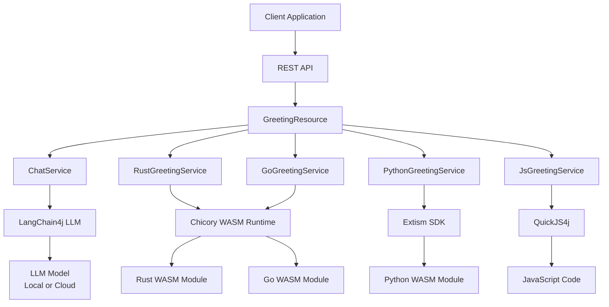

# Architecture Overview

This document provides a detailed look at the system architecture and how the different components interact to enable WebAssembly agents within the Java Virtual Machine.

## System Architecture



## Core Components

### 1. **REST API Layer**
- **GreetingResource**: Main REST endpoint handling HTTP requests
- **Path-based routing**: `/hello/{language}/{lang}/{name}` format
- **Content negotiation**: Supports text/plain input and output

### 2. **Service Layer**
- **ChatService**: LLM integration and context management
- **Language-specific services**: Individual services for each agent type
- **Dependency injection**: Managed by Quarkus CDI container

### 3. **WebAssembly Runtime Layer**
- **Chicory**: Pure Java WASM runtime for Rust and Go modules

### 4. **AI Integration Layer**
- **LangChain4j**: Java AI framework for LLM integration
- **Model abstraction**: Supports local and cloud-based models
- **Context management**: Handles conversation context and prompts

## Agent Implementations

### Rust Agent
```java
@ApplicationScoped
public class RustGreetingService {
    private static final WasmModule module = 
        Parser.parse(RustGreetingService.class
            .getResourceAsStream("/demos/rust/hello_agent.wasm"));
    
    public String greeting(String name, String lang) {
        Instance instance = Instance.builder(module).withStart(false).build();
        // WASM function invocation
        return result;
    }
}
```

**Key Features:**
- Direct WASM module loading
- Secure memory sandboxing
- No external dependencies

### Go Agent
```java
@ApplicationScoped
public class GoGreetingService {
    public String greeting(String name, String lang) {
        WasiOptions wasiOpts = WasiOptions.builder().inheritSystem().build();
        try (WasiPreview1 wasi = WasiPreview1.builder().withOptions(wasiOpts).build()) {
            // WASI-enabled WASM execution
            return result;
        }
    }
}
```

**Key Features:**
- WASI (WebAssembly System Interface) support
- TinyGo compilation

### Python Agent
```java
@ApplicationScoped
public class PythonGreetingService {
    private final Plugin plugin;
    
    public PythonGreetingService() {
        var wasm = ManifestWasm.fromBytes(/* WASM bytes */).build();
        var manifest = Manifest.ofWasms(wasm).build();
        this.plugin = Plugin.ofManifest(manifest).build();
    }
}
```

**Key Features:**
- Extism plugin system
- PyO3-based Python compilation
- Experimental

### JavaScript Agent
```java
@ApplicationScoped
public class JsGreetingService {
    @Invokables
    interface JsApi {
        @GuestFunction
        String greet(String name, String lang);
    }
    
    public String greeting(String name, String lang) {
        try (Runner runner = Runner.builder().withEngine(engine).build()) {
            JsApi jsApi = JsApi_Invokables.create(jsAgent, runner);
            return jsApi.greet(name, lang);
        }
    }
}
```

**Key Features:**
- Dynamic JavaScript execution
- Type-safe Java-JavaScript interop
- Annotation-based function mapping

## Data Flow

### 1. **Request Processing**
1. Client sends HTTP PUT request to `/hello/{lang}/{lang}/{name}`
2. `GreetingResource` extracts path parameters and request body
3. Language-specific service is selected based on path parameter
4. Agent generates greeting in specified language

### 2. **Agent Execution**
1. Service loads appropriate WASM module or JavaScript code
2. Parameters are serialized and passed to agent
3. Agent executes and returns greeting string
4. Result is logged and returned to controller

### 3. **LLM Integration**
1. `ChatService` receives greeting and user prompt
2. Context is constructed with language and name information
3. LLM processes the enhanced prompt
4. AI-generated response is returned to client

## Memory Management

### WebAssembly Memory
- **Rust/Go**: Managed by Chicory runtime with automatic cleanup
- **Python**: Handled by Extism plugin system
- **JavaScript**: Managed by QuickJS4j engine

### JVM Memory
- **Garbage Collection**: Automatic memory management for Java objects
- **Resource Management**: Try-with-resources for WASI and plugin cleanup
- **Memory Limits**: Configurable via JVM parameters

## Security Considerations

### WebAssembly Sandboxing
- **Memory Isolation**: Each WASM module runs in isolated memory space
- **Function Boundaries**: Limited access to host system functions
- **Resource Limits**: Configurable execution timeouts and memory limits

### JVM Security
- **Bytecode Verification**: JVM validates all loaded classes
- **Network Access**: Forbidden by default

## Performance Characteristics

### WebAssembly Benefits
- **Small Binary Size**: Efficient module loading and caching
- **Cross-platform**: Consistent execution across different architectures
- **Portability**: Easy to distribute and execute as a typical jar

### JVM Benefits
- **Optimized Runtime**: JIT compilation and garbage collection
- **Memory Management**: Automatic memory allocation and cleanup
- **Enterprise Features**: Monitoring, profiling, and debugging tools

## Scalability Considerations

### Horizontal Scaling
- **Stateless Design**: Services can be replicated across multiple instances
- **Load Balancing**: REST API can be distributed across multiple servers
- **Container Deployment**: Docker and Kubernetes support via Quarkus

### Vertical Scaling
- **Memory Optimization**: Tune JVM heap size for WASM module requirements
- **CPU Optimization**: Configure thread pools for concurrent agent execution
- **Native Compilation**: Use GraalVM for reduced memory footprint

## Monitoring and Observability

### Logging
- **Structured Logging**: JSON-formatted logs for easy parsing
- **Agent Execution**: Track individual agent performance and errors
- **LLM Integration**: Monitor AI model usage and response times

### Metrics
- **JVM Metrics**: Memory usage, GC performance, thread statistics
- **WASM Metrics**: Module loading time, execution duration
- **API Metrics**: Request rate, response time, error rates

### Tracing
- **Distributed Tracing**: Track requests across service boundaries
- **Performance Profiling**: Identify bottlenecks in agent execution
- **Error Tracking**: Monitor and alert on agent failures
